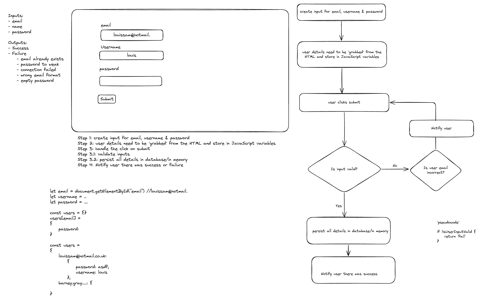

# Problem Solving Framework

Almost all problems can be tackled by taking a step-by-step approach to the problem:
1. Understand the problem, including edge cases
2. Break the problem down into smaller problems
3. Define an algorithm or flow chart
4. Start building

## Understand the Problem
Look at the problem and try to truly understand it, not from an implementation perspective but from a result perspective. Think about and identify:
- Inputs
- Outputs
- Edge cases

Edge cases are scenarios that rarely happen but might need some special consideration when they do. You need to be asking 'what happens if...?' For example, an edge case in division is dividing by zero - you would ask yourself 'what happens if I divide by zero?'

Take some time to truly understand the problem - it's a good investment of time because it will ensure you don't waste time barking up the wrong tree

## Break the problem down into smaller problems
Identify whether a problem can be broken into smaller problems that can each be solved separately. It is easiest to solve these problems separately when they are largely independent. For example, HTML is largely independent of CSS and JavaScript so you can break a website into these three parts. Or you could break your website into components e.g., a login page and a blog page for a blog website

## Define an algorithm or flow chart
For each of your sub problems (especially JavaScript problems), you can now create a flow chart. This should be as granular as possible and can describe an algorithm or a user Journey or both. Excalidraw is a great tool for creating flowcharts and wireframes (sketches of your website). 

## Start building
You are now ready to start writing your code. If you are working on a website, create a barebones frame with HTML and minimal CSS and try and get the JavaScript working. Then, once the website works as desired you can clean up and make more complex CSS. Work on one feature at a time. 

Example for login page:

[Back](links.md)